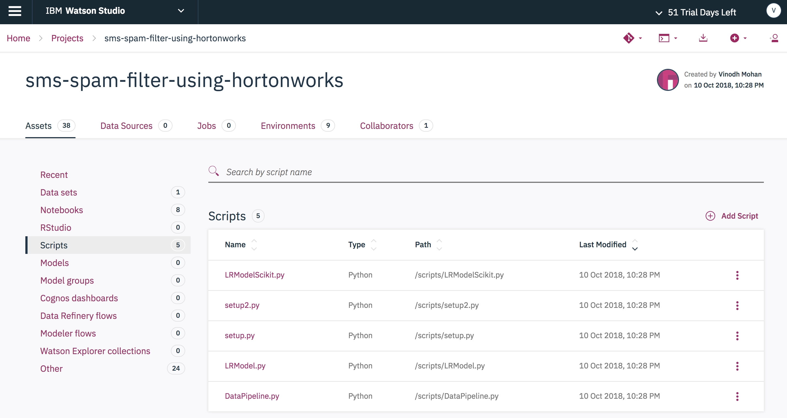

# Discover, Train and Deploy Spam Filter Model on Hortonworks Data Platform using DSX Local

The goal of this code pattern is to demonstrate how data scientists can leverage remote spark clusters from Hortonworks Data Platform (HDP) to train and deploy a Spam Filter Model using IBM's Data Science Experience Local (DSX Local).

Spam Filter is a classification model built using natural language processing and machine learning algorithms. The model is trained on the [sms spam collection dataset](https://www.kaggle.com/ishansoni/sms-spam-collection-dataset) to classify whether a given text message is spam or ham (not spam).

There are three different examples or illustrations to the problem:

* Develop a spam filter model using local spark ML (provided by DSX Local), train and deploy the model leveraging the remote spark in HDP cluster within DSX Local

* Develop a spam filter model using thrid pary library (Scikit-learn) in DSX Local, train and deploy the model leveraging the compute in remote HDP cluster within DSX Local

* Package the spam filter model as a python egg in DSX Local, train and deploy the model package levaraging both the remote spark and compute in HDP cluster within DSX Local

In order for the DSX Local to be able to utilize the resources (spark, compute) of the HDP cluster, DSX Hadoop Integration Service (DSXHI) must be installed on the edge node of the HDP cluster and the DSXHI must be registered with the DSX Local. 

> **What is HDP?** Hortonworks Data Platform (HDP) is a massively scalable platform for storing, processing and analyzing large volumes of data. HDP consists of the essential set of Apache Hadoop projects including MapReduce, Hadoop Distributed File System (HDFS), HCatalog, Pig, Hive, HBase, Zookeeper and Ambari.

  

   *Hortonworks Data Platform by [Hortonworks](https://hortonworks.com/products/data-platforms/hdp/)*

> **What is IBM DSX Local?** DSX Local is an on premises solution for data scientists and data engineers. It offers a suite of data science tools that integrate with RStudio, Spark, Jupyter, and Zeppelin notebook technologies. And yes, it can be configured to use HDP, too.

> **What is the IBM DSXHI?** DSX Hadoop Integration Service (DSXHI) is a service that can be installed on a Hadoop edge node to allow DSX Local Version 1.2 or later clusters to securely access data residing on the Hadoop cluster, submit interactive Spark jobs, build models, and schedule jobs that run as a YARN application on the Hadoop cluster.

This repo contains 8 jupyter notebooks and 6 scripts that are used to illustarte the three scenarios mentioned above.


**Scenario 1**: Spam Filter on local spark.ipynb (local pyspark) and Spam Filter on remote spark.ipynb (remote pyspark)

**Scenario 2**: Spam Filter using Scikit learn on local spark.ipynb (local python env) and Spam Filter using Scikit learn on remote spark.ipynb (remote python env)

**Scenario 3**: Building the Spam Filter Egg.ipynb, SpamFilter using egg deploy on remote Spark.ipynb (remote pyspark egg) and 
Building the Spam Filter Scikit Egg.ipynb, SpamFilter Scikit using egg deploy on remote Spark.ipynb (remote python egg)



When you have completed this code pattern, you will understand how to:

* Load data into Spark DataFrames and use Spark's machine learning library (MLlib) to develop, train and deploy the Spam Filter model
* Load the data into pandas DataFrames and use Scikit-learn machine learning lbrary to develop, train and deploy the spam Filter model
* Use sparkmagics library to connect to the remote spark service in HDP cluter through DSXHI
* Use sparkmagics library to push the python virtual environment containing the Scikit-learn library to the remote HDP cluster through DSXHI
* Package the spam filter model as a python egg and distribute the egg to the remote HDP cluster through DSXHI 

## Architecture


1. Load the wine classification dataset into Apache Hadoop HDFS running on HDP.
2. Use Spark DataFrame operations to clean the dataset and use Spark MLlib to train a PCA classification model.
3. Save the resulting model into DSX Local.
4. The user can run the provided notebooks in DSX Local.
5. As the notebook runs, Apache Livy will be called to interact with the Spark service in HDP.
6. Use IBM Deployment Manager to deploy and access the model to generate wine classification.

## Included components

* [IBM Data Science Experience Local](https://content-dsxlocal.mybluemix.net/docs/content/local/overview.html): An out-of-the-box on premises solution for data scientists and data engineers. It offers a suite of data science tools that integrate with RStudio, Spark, Jupyter, and Zeppelin notebook technologies.
* [Apache Spark](http://spark.apache.org/): An open-source, fast and general-purpose cluster computing system.
* [Hortonworks Data Platform (HDP)](https://hortonworks.com/products/data-platforms/hdp/): HDP is a massively scalable platform for storing, processing and analyzing large volumes of data. HDP consists of the essential set of Apache Hadoop projects including MapReduce, Hadoop Distributed File System (HDFS), HCatalog, Pig, Hive, HBase, Zookeeper and Ambari.
* [Apache Livy](https://livy.incubator.apache.org/): Apache Livy is a service that enables easy interaction with a Spark cluster over a REST interface.
* [Jupyter Notebooks](http://jupyter.org/): An open-source web application that allows you to create and share documents that contain live code, equations, visualizations and explanatory text.

## Featured technologies

* [Artificial Intelligence](https://medium.com/ibm-data-science-experience): Artificial intelligence can be applied to disparate solution spaces to deliver disruptive technologies.
* [Python](https://www.python.org/): Python is a programming language that lets you work more quickly and integrate your systems more effectively.

# Prerequisites

## Access to HDP Platform

The core of this code pattern is integrating Hortonworks Data Platform (HDP) and IBM DSX Local. If you do not already have an HDP cluster available for use, you will need to install one before attempting to complete the code pattern. 

To install [HDP v2.6.4](https://docs.hortonworks.com/HDPDocuments/HDP2/HDP-2.6.4/index.html), please follow the [installation guide](https://docs.hortonworks.com/HDPDocuments/Ambari-2.6.1.5/bk_ambari-installation/content/ch_Getting_Ready.html) provided by Hortonworks. It first requires the installation of the [Apache Ambari](https://ambari.apache.org/) management platform which is then used to faciliate the HDP cluster installation. The Ambari Server is also required to complete a number of steps described in the following sections.

> Note: Ensure that your Ambari Server is configured to use `Python v2.7`.

## Install HDP Cluster services

Once your HDP cluster is deployed, at a minimum, install the following services as listed in this Ambari Server UI screenshot:


> Note: This code pattern requires that version `2.2.0` of the `Spark2` service be installed.

## Install DSX Local

https://content-dsxlocal.mybluemix.net/docs/content/local/welcome.html

## Install DSX Hadoop Integration Service (DSXHI) with HDP

https://content-dsxlocal.mybluemix.net/docs/content/local/hdp.html#hdp__option-1

## Register DSX Hadoop Integration Service (DSXHI) with DSXL

https://content-dsxlocal.mybluemix.net/docs/content/local/hadoopintegration.html

# Steps

Follow these steps to setup the proper environment to run our notebooks locally.

1. [Clone the repo](#1-clone-the-repo)
1. [Download and move data to HDFS on Hortonworks](#2-download-and-move-data-to-hdfs-on-hortonworks)
1. [Create project in IBM DSX Local](#3-create-project-in-ibm-dsx-local)
1. [Create project assets](#4-create-project-assets)
1. [Run the notebooks to create our model](#5-run-the-notebooks-to-create-our-model)
1. [Commit changes to DSX Local Master Repository](#6-commit-changes-to-dsx-local-master-repository)
1. [Create release project in IBM Deployment Manager](#7-create-release-project-in-ibm-deployment-manager)
1. [Deploy our model as a web service](#8-deploy-our-model-as-a-web-service)
1. [Deploy our scripts as a job](#9-deploy-our-scripts-as-a-job)
1. [Bring deployments on-line](#10-bring-deployments-on-line)
1. [Gather API endpoints data for use in scripts](#11-gather-api-endpoints-data-for-use-in-scripts)
1. [Modify scripts in DSX Local](#12-modify-scripts-in-dsx-local)
1. [Run scripts locally to test](#13-run-scripts-locally-to-test)
1. [Manage your model with the Deployment Manager](#14-manage-your-model-with-the-deployment-manager)

### 1. Clone the repo
```
git clone https://github.com/IBM/sms-spam-filter-using-hortonworks.git
```

### 2. Download and move data to HDFS on Hortonworks


# Troubleshooting

* An error was encountered: Session XX unexpectedly reached final status 'dead'. See logs: java.lang.Exception: No YARN application is found with tag livy-session-XX in 120 seconds. Please check your cluster status, it is may be very busy.

If you see this error trying to start a remote Spark session (which is attempted in the pca-features notebook), it may indicate that the username that you logged into DSX Local with has not been registered on the HDP Hadoop cluster.

# Links

* [Teaming on Data: IBM and Hortonworks Broaden Relationship](https://hortonworks.com/blog/teaming-data-ibm-hortonworks-broaden-relationship/)
* [Certification of IBM Data Science Experience (DSX) on HDP is a Win-Win for Customers](https://hortonworks.com/blog/certification-ibm-data-science-experience-dsx-hdp-win-win-customers/)
* [An Exciting Data Science Experience on HDP](https://hortonworks.com/blog/exciting-data-science-experience-hdp/)

# Learn more

* **Data Analytics Code Patterns**: Enjoyed this Code Pattern? Check out our other [Data Analytics Code Patterns](https://developer.ibm.com/code/technologies/data-science/)
* **AI and Data Code Pattern Playlist**: Bookmark our [playlist](https://www.youtube.com/playlist?list=PLzUbsvIyrNfknNewObx5N7uGZ5FKH0Fde) with all of our Code Pattern videos
* **Watson Studio**: Master the art of data science with IBM's [Watson Studio](https://datascience.ibm.com/)
* **Spark on IBM Cloud**: Need a Spark cluster? Create up to 30 Spark executors on IBM Cloud with our [Spark service](https://console.bluemix.net/catalog/services/apache-spark)

# License
[Apache 2.0](LICENSE)
