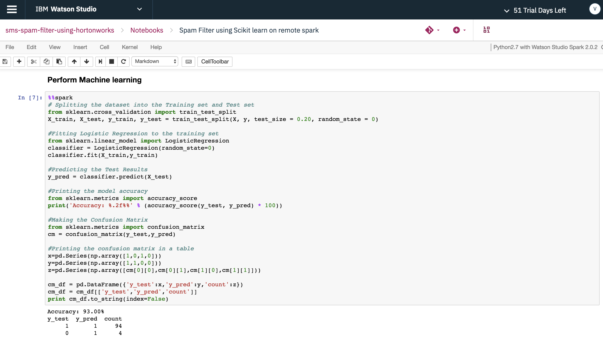
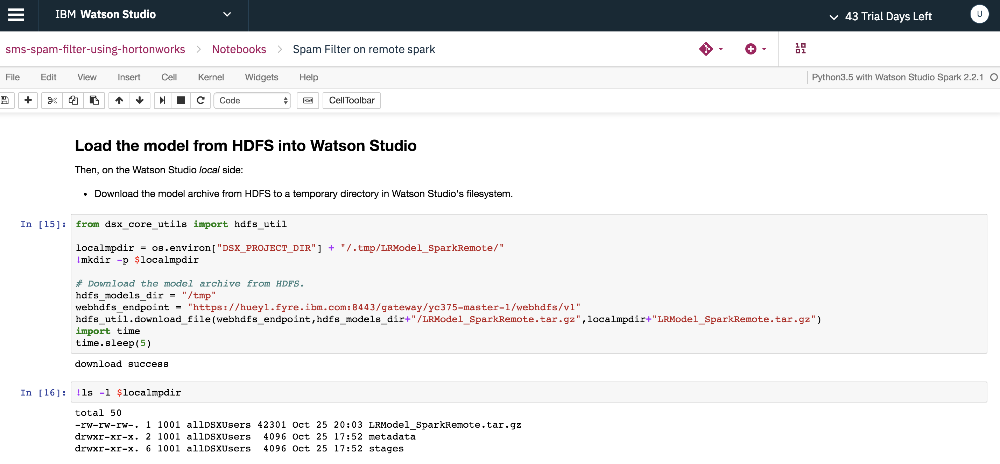

# Discover, Train and Deploy Spam Filter Model on Hortonworks Data Platform using IBM Watson Studio Local

The goal of this code pattern is to demonstrate how data scientists can leverage remote Spark clusters and compute environments from Hortonworks Data Platform (HDP) to train and deploy a Spam Filter Model using IBM's Watson Studio Local (formerly named Data Science Experience Local, or DSX Local).

A Spam Filter is a classification model built using natural language processing and machine learning algorithms. The model is trained on the [sms spam collection dataset](https://www.kaggle.com/ishansoni/sms-spam-collection-dataset) to classify whether a given text message is spam, or ham (not spam).

This code pattern provides three different examples or illustrations to tackle this problem:

Note: All the development and training included below, including references to the HDP cluster, are initiated from within IBM's Watson Studio Local.

* Develop and train a Spam Filter Model using PySpark, both locally (using local Spark ML provided by Watson Studio Local) and remotely (by leveraging the remote Spark in the HDP cluster).

* Develop and train a Spam Filter Model using the 3rd-party library Scikit-learn, both locally (using Scikit-learn provided by Watson Studio Local) and remotely (by leveraging the compute in the HDP cluster).

* Package the Spam Filter Model as a python egg in Watson Studio Local, then train and deploy the model package leveraging both the remote Spark and compute in the HDP cluster.

For Watson Studio Local to be able to utilize the resources (both Spark and compute) of the HDP cluster, the IBM Hadoop Integration service must be installed on the edge node of the HDP cluster and must be registered with Watson Studio Local.

First, some background:

> **What is HDP?** Hortonworks Data Platform (HDP) is a massively scalable platform for storing, processing and analyzing large volumes of data. HDP consists of the essential set of Apache Hadoop projects including MapReduce, Hadoop Distributed File System (HDFS), HCatalog, Pig, Hive, HBase, Zookeeper, and Ambari.

  

   *Hortonworks Data Platform by [Hortonworks](https://hortonworks.com/products/data-platforms/hdp/)*

> **What is IBM Watson Studio Local?** Watson Studio Local is an on-premises solution for data scientists and data engineers. It offers a suite of data science tools that integrate with RStudio, Spark, Jupyter, and Zeppelin notebook technologies. And yes, it can be configured to use HDP, too.

> **What is the IBM Hadoop Integration service?** A service that can be installed on a Hadoop edge node to allow Watson Studio Local (version 1.2 or later) clusters to securely access data residing on the Hadoop cluster, submit interactive Spark jobs, build models, and schedule jobs that run as a YARN application on the Hadoop cluster.
> **NOTE:** The Hadoop Integration service was previously referred to as DSXHI, and that acronym may still be used in some older documentation links and code snippets.

This code pattern contains 8 Jupyter notebooks and 6 scripts. Here is a view of the notebooks as shown by the Watson Studio Local UI:


As mentioned earlier, this code pattern offers three examples of how to develop, train, and deploy a Spam Filter Model. For each example, multiple notebooks will be provided to show both a local (Watson Studio Local) and remote (HDP cluster) solution. The following lists the associated notebooks for each:

* Develop and train a Spam Filter using PySpark.

  `"Spam Filter on local spark"`
    - Load the spam collection dataset using Spark context in Watson Studio Local.
    - Use Spark Data Pipeline to extract the TF-IDF features and use Spark MLlib to train the Spam Filter PySpark model locally.
    - Save the Spam Filter PySpark model in Watson Studio Local.

  `"Spam Filter on remote spark"`
    - Push the spam collection dataset to the remote HDFS user directory in the HDP cluster.
    - Connect to the remote Spark context in the HDP cluster via the Hadoop Integration service using the sparkmagics library.
    - Uses `%%spark` to run the remote Spark context to load, extract and train the Spam Filter PySpark model in the HDP cluster.
    - Save the Spam Filter PySpark model in HDP cluster and import the model into Watson Studio Local.

* Develop and train a Spam Filter using the 3rd-party library Scikit-learn.

  `"Spam Filter using Scikit learn on local spark"`
    - Load the spam collection dataset using Spark context in Watson Studio Local.
    - Uses scikit-learn libraries to extract the `Bag of Words` features and to train the Spam Filter python model locally.

  `"Spam Filter using Scikit learn on remote spark"`
    - Push the spam collection dataset to the remote HDFS user directory in the HDP cluster.
    - Connects to the remote Spark context in the HDP cluster via the Hadoop Integration service using the sparkmagics library.
    - Use `%%spark` to run the remote Spark context to use scikit-learn libraries to extract the `Bag of Words` features and to train the Spam Filter python model in the HDP cluster.

* Package a Spam Filter model as a python egg, then train and deploy the model package remotely in the HDP cluster.

  `"Building the Spam Filter Egg"`
    - Builds the Spam Filter PySpark model as an egg using the provided scripts.

  `"SpamFilter using egg deploy on remote Spark"`
    - Push the spam collection dataset to the remote HDFS user directory in the HDP cluster.
    - Push the PySpark egg to the remote HDFS user directory in the HDP cluster.
    - Connect to remote Spark context in HDP cluster via the Hadoop Integration service using the sparkmagics library.
    - Use `%%spark` to deploy the PySpark egg to the remote HDP cluster.
    - Use `%%spark` to run the functions provided by PySpark egg to train the Spam Filter model in the HDP cluster.

  `"Building the Spam Filter Scikit Egg"`
    - Builds the Spam Filter python (scikit) model as an egg using the provided script.

  `"SpamFilter Scikit using egg deploy on remote Spark"`
    - Push the spam collection dataset to the remote HDFS user directory in the HDP cluster.
    - Push the python (scikit) egg to the remote HDFS user directory in the HDP cluster.
    - Connect to remote Spark context in HDP cluster via the Hadoop Integration service using the sparkmagics library.
    - Push the python virtual environment loaded with scikit-learn to the HDP cluster via the Hadoop Integration service using the sparkmagics library.
    - Use `%%spark` to deploy the python (scikit) egg to the remote HDP cluster.
    - Use `%%spark` to run the functions provided by python (scikit) egg to train the Spam Filter model in the HDP cluster.

When you have completed this code pattern, you will understand how to:

* Load data into Spark DataFrames and use Spark's machine learning library (MLlib) to develop, train and deploy the Spam Filter Model.
* Load the data into pandas DataFrames and use Scikit-learn machine learning library to develop, train and deploy the Spam Filter Model.
* Use the `sparkmagics` library to connect to the remote Spark service in the HDP cluster via the Hadoop Integration service.
* Use the `sparkmagics` library to push the python virtual environment containing the Scikit-learn library to the remote HDP cluster via the Hadoop Integration service.
* Package the Spam Filter model as a python egg and distribute the egg to the remote HDP cluster via the Hadoop Integration service.
* Run the Spam Filter Model (both PySpark and Scikit-learn versions) in the remote HDP cluster utilizing the remote Spark context and the remote python virtual environment, all from within IBM Watson Studio Local.
* Save the Spam Filter Model in remote HDP cluster and import it back to Watson Studio Local and batch score and evaluate the model

## Flow


This diagram depicts the major components and actions that make-up the Watson Studio Local and HDP cluster environment.

1. The spam collection data set is loaded into Watson Studio Local as an asset.
2. The user interacts with the Jupyter notebooks by running them in Watson Studio Local. Watson Studio Local can either use the resources available locally or ...
3. Utilize HDP cluster resources by connecting to Apache Livy, which is a part of the Hadoop Integration service.
4. Livy connects with the HDP cluster to run Apache Spark or access HDFS files.

## Included components

* [IBM Watson Studio Local](https://content-dsxlocal.mybluemix.net/docs/content/local/overview.html): An out-of-the-box on-premises solution for data scientists and data engineers. It offers a suite of data science tools that integrate with RStudio, Spark, Jupyter, and Zeppelin notebook technologies.
* [Apache Spark](http://spark.apache.org/): An open-source, fast and general-purpose cluster computing system.
* [Hortonworks Data Platform (HDP)](https://hortonworks.com/products/data-platforms/hdp/): HDP is a massively scalable platform for storing, processing and analyzing large volumes of data. HDP consists of the essential set of Apache Hadoop projects including MapReduce, Hadoop Distributed File System (HDFS), HCatalog, Pig, Hive, HBase, Zookeeper, and Ambari.
* [Apache Livy](https://livy.incubator.apache.org/): Apache Livy is a service that enables easy interaction with a Spark cluster over a REST interface.
* [Jupyter Notebooks](http://jupyter.org/): An open-source web application that allows you to create and share documents that contain live code, equations, visualizations, and explanatory text.

## Featured technologies

* [Artificial Intelligence](https://medium.com/ibm-data-science-experience): Artificial intelligence can be applied to disparate solution spaces to deliver disruptive technologies.
* [Python](https://www.python.org/): Python is a programming language that lets you work more quickly and integrate your systems more effectively.

# Prerequisites

## Access to HDP Platform

The core of this code pattern is integrating Hortonworks Data Platform (HDP) and IBM Watson Studio Local. If you do not already have an HDP cluster available for use, you will need to install one before attempting to complete the code pattern. 

To install [HDP v2.6.4](https://docs.hortonworks.com/HDPDocuments/HDP2/HDP-2.6.4/index.html), please follow the [installation guide](https://docs.hortonworks.com/HDPDocuments/Ambari-2.6.1.5/bk_ambari-installation/content/ch_Getting_Ready.html) provided by Hortonworks. It first requires the installation of the [Apache Ambari](https://ambari.apache.org/) management platform which is then used to facilitate the HDP cluster installation.

> Note: Ensure that your Ambari Server is configured to use `Python v2.7`.

### Install HDP Cluster services

Once your HDP cluster is deployed, at a minimum, install the following services as listed in this Ambari Server UI screenshot:


> Note: This code pattern requires that version `2.2.0` of the `Spark2` service be installed.

## Watson Studio Local setup

Watson Studio Local provides a suite of data science tools, such as Spark and Jupyter notebooks, that are needed to complete this code pattern. Use the following links to install and configure your Watson Studio Local instance and required services.

### Install Watson Studio Local    

https://content-dsxlocal.mybluemix.net/docs/content/local/welcome.html provides links for installation and administration/user guides.

### Install Watson Studio Local Hadoop Integration service with HDP

https://content-dsxlocal.mybluemix.net/docs/content/local/hdp.html

### Register Watson Studio Local Hadoop Integration service with Watson Studio Local

https://content-dsxlocal.mybluemix.net/docs/content/local/hadoopintegration.html#hadoopintegration__register

# Steps

Follow these steps to set up the proper environment to run our notebooks locally.

1. [Clone the repo](#1-clone-the-repo)
1. [Create project in IBM Watson Studio Local](#2-create-project-in-ibm-watson-studio-local)
1. [Create project assets](#3-create-project-assets)
1. [Commit changes to Watson Studio Local Master Repository](#4-commit-changes-to-watson-studio-local-master-repository)
1. [Run the notebooks listed for each example](#5-run-the-notebooks-listed-for-each-example)

### 1. Clone the repo
```
git clone https://github.com/IBM/sms-spam-filter-using-hortonworks.git
```
### 2. Create project in IBM Watson Studio Local

In Watson Studio Local, we use projects as a container for all of our related assets. To create a project:

* From the Watson Studio Local homepage, select the `Add Project` button.


* Enter your project name and press the `Create` button.


### 3. Create project assets

Once created, you can view all of the project assets by selecting the `Assets` tab from the project's home page.


For our project, we need to add our notebooks, scripts, and datasets. To add our notebooks:

* Select `Notebooks` in the project `Assets` list, then press the `Add Notebook` button.

* Enter a unique notebook name and use the `From URL` option to load the notebook from the GitHub repo.


* Enter this URL:

```
https://raw.githubusercontent.com/IBM/sms-spam-filter-using-hortonworks/master/notebooks/Spam%20Filter%20on%20local%20spark.jupyter.ipynb
```

> Note: while you are free to use any notebook name you wish, it may be easier to follow along with these instructions if you copy the names listed previously, which is basically lifting the name directly from the URL. For example, name the previous notebook `"Spam Filter on local spark"`.

* Repeat this step to add the remaining 7 notebooks, using the following URLs:
```
https://raw.githubusercontent.com/IBM/sms-spam-filter-using-hortonworks/master/notebooks/Spam%20Filter%20on%20remote%20spark.jupyter.ipynb
```
```
https://raw.githubusercontent.com/IBM/sms-spam-filter-using-hortonworks/master/notebooks/Spam%20Filter%20using%20Scikit%20learn%20on%20local%20spark.jupyter.ipynb
```
```
https://raw.githubusercontent.com/IBM/sms-spam-filter-using-hortonworks/master/notebooks/Spam%20Filter%20using%20Scikit%20learn%20on%20remote%20spark.jupyter.ipynb
```
```
https://raw.githubusercontent.com/IBM/sms-spam-filter-using-hortonworks/master/notebooks/Building%20the%20Spam%20Filter%20Egg.jupyter.ipynb
```
```
https://raw.githubusercontent.com/IBM/sms-spam-filter-using-hortonworks/master/notebooks/Building%20the%20Spam%20Filter%20Scikit%20Egg.jupyter.ipynb
```
```
https://raw.githubusercontent.com/IBM/sms-spam-filter-using-hortonworks/master/notebooks/SpamFilter%20Scikit%20using%20egg%20deploy%20on%20remote%20Spark.jupyter.ipynb
```
```
https://raw.githubusercontent.com/IBM/sms-spam-filter-using-hortonworks/master/notebooks/SpamFilter%20using%20egg%20deploy%20on%20remote%20Spark.jupyter.ipynb
```

To add our scripts:

* Select `Scripts` in the project `Assets` list, then press the `Add Script` button.


* Click on the `From File` tab. Use the `Drag and Drop` option to load the script file from your local repo. For script `Name`, keep the default value that is auto-generated from the downloaded file.


* Add the following scripts:
```
scripts/DataPipeline.py
scripts/LRModel.py
scripts/LRModelScikit.py
scripts/__init__.py
scripts/setup.py
scripts/setup2.py
```

To add our dataset:

* Select `Data sets` in the project `Assets` list, then press the `Add Data Set` button.


* Click the `Select from your local file system` button to select the file `/data/SMSSpamCollection.csv` from your local repo.

### 4. Commit changes to Watson Studio Local Master Repository

After making changes to your project, you will be occasionally reminded to commit and push your changes to the Watson Studio Local Master Repository.


Now that we have added our assets, let's go ahead and do that. Commit and push all of our new assets, and set the version tag to `v1.0`.


### 5. Run the notebooks listed for each example

To view our notebooks, Select `Notebooks` in the project `Assets` list.


First, some background on how to execute a notebook: 

> When a notebook is executed, what is actually happening is that each code cell in
the notebook is executed, in order, from top to bottom.
>
> Each code cell is selectable and is preceded by a tag in the left margin. The tag
format is `In [x]:`. Depending on the state of the notebook, the `x` can be:
>
>* A blank, this indicates that the cell has never been executed.
>* A number, this number represents the relative order this code step was executed.
>* A `*`, which indicates that the cell is currently executing.
>
>There are several ways to execute the code cells in your notebook:
>
>* One cell at a time.
>   * Select the cell, and then press the `Play` button in the toolbar.
>* Batch mode, in sequential order.
>   * From the `Cell` menu bar, there are several options available. For example, you
    can `Run All` cells in your notebook, or you can `Run All Below`, that will
    start executing from the first cell under the currently selected cell, and then
    continue executing all cells that follow.
>* At a scheduled time.
>   * Press the `Schedule` button located in the top right section of your notebook
    panel. Here you can schedule your notebook to be executed once at some future
    time, or repeatedly at your specified interval.

As described above, this code pattern provides 3 examples of solving the Spam Filter problem. And each of the examples consists of multiple notebooks. We recommend that you run all of them to see the multiple ways to build, train and deploy a model, and for  accessing resources on the remote HDP cluster.

While each of the notebooks is well documented, some actions will be covered in more detail below.

#### 1. Upload data to remote HDP cluster

To upload data from the Watson Studio Local cluster to the HDP cluster, utilize the `upload_hdfs_file` method from the `dsx_core_utils` library. This is only available when the Hadoop Integration service is registered to upload the dataset to the remote HDP cluster.


> Note: set both the target path and the HDFS Web URL to match your environment

#### 2. Connect to remote Spark on the HDP cluster via the Hadoop Integration service using the sparkmagics library

To create a remove Spark session on your HDP cluster, utilize the `sparkmagics` and `dsx_core_utils` library.

As shown below, copy the Livy endpoint associated with your HDP cluster, then add it as a Hadoop Integration service endpoint.


Then create a remote session as shown below.


> Note: Be patient - it may take a few minutes.

#### 3. Run Spam Filter PySpark Model in HDP cluster using %% within Watson Studio Local

With the remote Spark session created, use %%spark as a notation which will run the cell contents in remote Spark service in the HDP cluster.

Note: If you use %spark - it will run the cell contents in local Spark in Watson Studio Local


Run the Spam Filter PySpark model in remote HDP cluster using %%spark at the beginning of the cell.


#### 4. Push python virtual environment to remote HDP cluster via the Hadoop Integration service using the sparkmagics library

HDP cluster doesn't natively support third party libraries such as scikit-learn, Keras, Tensor flow etc. 

In order to run the Spam Filter python model built using the scikit-learn library, the python virtual environment used in Watson Studio Local needs to be pushed to the remote HDP cluster as shown below.


Copy the Hadoop Integration service connection properties containing the python virtual environment to the `properties` tab in `%manage_spark` window and create the remote session.


#### 5. Run Spam Filter python Model in HDP cluster using %% within Watson Studio Local

With the remote python session created, use %%spark as a notation which will run the cell contents in remote python environment in HDP cluster.


Run the spam filter python scikit-learn model in the remote HDP cluster using %%spark at the beginning of the cell.



#### 6. Build Spam Filter Pyspark egg and execute the LRModel in remote HDP cluster

Another approach to running the Spam Filter model is to package the code that is run via notebooks in previous examples into an egg file and then distribute the egg file across the remote HDP cluster.

Once distributed, the model function can be invoked via Watson Studio Local to execute the Spam Filter model.

After copying the necessary scripts, run the cell below to build the Spam Filter PySpark egg.


Connect to remote Spark in HDP cluster and run the LRModel function using %%spark as notation to execute the Spam Filter PySpark model.


#### 7. Build Spam Filter python egg and execute the LRModelScikit in remote HDP cluster

After copying the necessary scripts, run the cell below to build the Spam Filter scikit-learn egg.


Connect to remote Spark in HDP cluster and run the LRModelScikit function using %%spark as notation to execute the Spam Filter scikit-learn model.


#### 8. Save the Spam Filter PySpark Model in Watson Studio Local

Use the save function in `dsx_ml.ml` library to save the Spam Filter PySpark model with the name `LRModel_SparkLocal`.


#### 9. Save the Spam Filter PySpark Model in remote HDP cluster

After training the model (step 3) in remote HDP cluster, the model exists in the memory of the remote session. Write the model to an HDFS location and copy it to the local node as shown below.


Create an archive of the model directory and push the archive back to HDFS.


#### 10. Import the Spam Filter PySpark Model from remote HDP cluster into Watson Studio Local

In order to use the PySpark model saved in the remote HDP cluster, you need to import into Watson Studio Local. Download the moddel archive from HDFS to a temporary directory in Watson Studio Local using the method provided in the `hdfs_util` library.



Unpack the model archive and load the model into memory in Watson Studio Local environment and then save the model using `dsx_ml.ml` library 


You can now see the saved model `LRModel_SparkRemote` in the `Models` tab. 


#### 11. Batch score the Spam Filter PySpark Model

Click any one of the above models to test and score. Provide a test message as `Input` and press `submit` to do a real-time scoring.


Select the `Execution Type`, `Input data set` and `Output data set` and click `Generate batch script` to do a batch scoring run.


Refresh the page and check the status of the job.


Go to the `Datasets` tab to view the Output file.


#### 12. Evaluate the Spam Filter PySpark Model

Choose the `Evaluate` tab and provide `Input data set`, `Evaluator`, `Threshold metric` and click `Generate evaluation script` to evaluate the model.


Refresh the page and check the status of the job.


You can check the list of batch scoring and model evaluation scripts created in the `Jobs` tab in the main page of the project folder.


# Troubleshooting

* An error was encountered: Session XX unexpectedly reached final status 'dead'. See logs: java.lang.Exception: No YARN application is found with tag livy-session-XX in 120 seconds. Please check your cluster status, it is may be very busy.

If you see this error trying to start a remote Spark session, it may indicate that the username that you logged into Watson Studio Local with has not been registered on the HDP Hadoop cluster.

# Links

* [Teaming on Data: IBM and Hortonworks Broaden Relationship](https://hortonworks.com/blog/teaming-data-ibm-hortonworks-broaden-relationship/)
* [Certification of IBM Data Science Experience (DSX) on HDP is a Win-Win for Customers](https://hortonworks.com/blog/certification-ibm-data-science-experience-dsx-hdp-win-win-customers/)
* [An Exciting Data Science Experience on HDP](https://hortonworks.com/blog/exciting-data-science-experience-hdp/)

# Learn more

* **Data Analytics Code Patterns**: Enjoyed this Code Pattern? Check out our other [Data Analytics Code Patterns](https://developer.ibm.com/code/technologies/data-science/)
* **AI and Data Code Pattern Playlist**: Bookmark our [playlist](https://www.youtube.com/playlist?list=PLzUbsvIyrNfknNewObx5N7uGZ5FKH0Fde) with all of our Code Pattern videos
* **Watson Studio**: Master the art of data science with IBM's [Watson Studio](https://datascience.ibm.com/)
* **Spark on IBM Cloud**: Need a Spark cluster? Create up to 30 Spark executors on IBM Cloud with our [Spark service](https://console.bluemix.net/catalog/services/apache-spark)

# License
This code pattern is licensed under the Apache Software License, Version 2.  Separate third party code objects invoked within this code pattern are licensed by their respective providers pursuant to their own separate licenses. Contributions are subject to the [Developer Certificate of Origin, Version 1.1 (DCO)](https://developercertificate.org/) and the [Apache Software License, Version 2](http://www.apache.org/licenses/LICENSE-2.0.txt).

[Apache Software License (ASL) FAQ](http://www.apache.org/foundation/license-faq.html#WhatDoesItMEAN)
